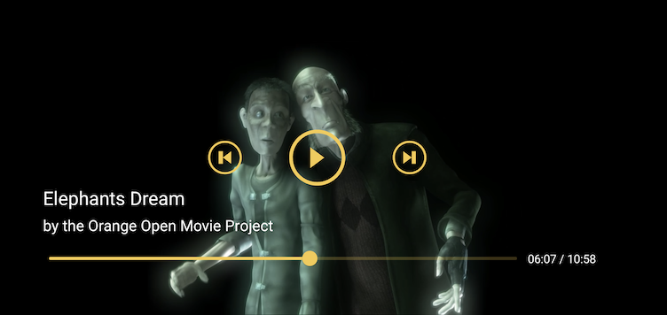

# THEOplayer Media Session Connector #

The media session connector provides a universal way for Android to interact with THEOplayer.
Integrating with the connector allows an app to advertise media playback and to 
receive playback commands from external sources, such as from a TV remote or through 
Google Assistant commands using voice commands such as _'What is currently playing?'_.

## Android Media Session

As described on the Android documentation pages [Using a Media Session]:

> Media sessions provide a universal way of interacting with an audio or video player.
By informing Android that media is playing in an app,
playback controls can be delegated to the app.
Integrating with the media session allows an app to advertise media playback externally and to
receive playback commands from external sources. These sources can be physical buttons
(such as the play button on a headset or TV remote control) or indirect commands
(such as instructing "pause" to Google Assistant). The media session then delegates these commands to
the app that applies them to the media player for which it is transparent where the commands originated.

## Getting Started

This section details how to integrate the connector in a video app, as demonstrated on Android's
[Building a video app].
The app will advertise its player state and media metadata to the media session through the connector,
and responds to requests from the media session.

In this example the media session is active as long as the app's activity is active and running in the
foreground. The full example code is available in our [Sample repository].

For a demonstration on how to build a more extensive app that does background audio playback,
we refer to the Android documentation on [Building an audio app], as well as our [Sample repository].

### Creating the media session connector

After [Creating and initializing a media session], pass the `mediaSession` and THEOplayer instances to the connector.

Optionally set the `debug` flag to receive log statements from the connector.

```
private lateinit var mediaSession: MediaSessionCompat
private lateinit var mediaSessionConnector: MediaSessionConnector

public override fun onCreate(savedInstanceState: Bundle?) {
    super.onCreate(savedInstanceState)

    // Create and initialize the media session
    mediaSession = MediaSessionCompat(this, TAG).apply {
        // Do not let MediaButtons restart the player when the app is not visible
        setMediaButtonReceiver(null)
    }

    // Create a MediaSessionConnector and attach the THEOplayer instance.
    mediaSessionConnector = MediaSessionConnector(mediaSession)
    mediaSessionConnector.debug = true
    
    // Pass the player instance
    mediaSessionConnector.player = viewBinding.theoPlayerView.player
    
    // Set mediaSession to active
    mediaSessionConnector.setActive(true)
}
```

### Passing media metadata

The connector advertises the currently playing asset to the media session.
The `MetadataDescription` object that is passed to THEOplayer's source description provides
additional information on the asset, such as title, author and an icon.

If your app uses a [MediaController] to interact with the media session, the [onMetadataChanged]
callback can be used to display the metadata on screen.

A full list of supported metadata properties is available in [MediaMetadataProvider]

```
val metadataFields = hashMapOf<String, Any>(
    "title" to "Elephants Dream",
    "displaySubtitle" to "by the Orange Open Movie Project",
    "mediaId" to "stream01",
    "mediaUri" to "https://theoplayer.com",
    "album" to "THEOplayer test streams",
    "author" to "THEOplayer"
)
player.source = SourceDescription.Builder(
    TypedSource.Builder("https://cdn.theoplayer.com/video/elephants-dream/playlistCorrectionENG.m3u8")
        .type(SourceType.HLSX)
        .build()
    )
    .metadata(MetadataDescription(metadataFields))
    .build()
```



### Lifecyle callbacks

The THEOplayer instance needs to know about the Activity's lifecycle methods.
In accordance, the connector will need to update its state as well.

```
override fun onPause() {
    viewBinding.theoPlayerView.onPause()
    mediaSessionConnector.setActive(false)
    super.onPause()
}

override fun onResume() {
    viewBinding.theoPlayerView.onResume()
    mediaSessionConnector.setActive(true)
    super.onResume()
}

override fun onDestroy() {
    mediaSessionConnector.destroy()
    viewBinding.theoPlayerView.onDestroy()
    super.onDestroy()
}
```

### Connector interfaces

Besides basic playback requests, the media session can also send requests related to
queued media items, setting ratings and custom actions. These are forwarded to optionally implemented
interfaces of the connector:

- `QueueNavigator` allows handling queue navigation actions.
- `QueueEditor` allows handling queue editing actions.
- `PlaybackPreparer` allows handling media prepare actions.
- `RatingCallback` allows handling rating actions.
- `CustomActionProvider` allows handling custom actions.

We refer to our [Sample repository]
for an example on how these could be implemented.

### Dispatching media commands

Using `adb` (Android Debug Bridge), media commands can be triggered command-line as well:

```
$ adb shell media dispatch KEY
```

with `KEY` being any command 
`play, pause, play-pause, mute, headsethook, stop, next, previous, rewind, record, fast-forward.`

### Media player state

The player's current state can be queried using `adb`:

```
$ adb shell dumpsys media_session

MEDIA SESSION SERVICE (dumpsys media_session)

5 sessions listeners.
Global priority session is null
User Records:
Record for full_user=0
  Volume key long-press listener: null
  Volume key long-press listener package: 
  Media key listener: null
  Media key listener package: 
  Callback: android.media.session.ICallback$Stub$Proxy@ff4b775
  Last MediaButtonReceiver: null
  Restored MediaButtonReceiver: null
  Restored MediaButtonReceiverComponentType: 0
  Media button session is com.theoplayer.android.mediasession.demo/PlayerActivity (userId=0)
  Sessions Stack - have 2 sessions:
    PlayerActivity com.theoplayer.android.mediasession.demo/PlayerActivity (userId=0)
      ownerPid=7705, ownerUid=10060, userId=0
      package=com.theoplayer.android.mediasession.demo
      launchIntent=null
      mediaButtonReceiver=null
      active=true
      flags=3
      rating type=0
      controllers: 15
      state=PlaybackState {state=3, position=45840, buffered position=66664, speed=1.0, updated=333568, actions=4199295, custom actions=[], active item id=1, error=null}
      audioAttrs=AudioAttributes: usage=USAGE_MEDIA content=CONTENT_TYPE_UNKNOWN flags=0x800 tags= bundle=null
      volumeType=1, controlType=2, max=0, current=0
      metadata: size=5, description=Elephants Dream, null, Elephants Dream
      queueTitle=null, size=0
```

## Resources

- [Using a media session]
- [Building an audio app]
- [Building a video app]

[Sample repository]: https://github.com/THEOplayer/samples-android-sdk
[Using a media session]: https://developer.android.com/guide/topics/media-apps/working-with-a-media-session
[Creating and initializing a media session]: https://developer.android.com/guide/topics/media-apps/working-with-a-media-session#init-session
[Building a video app]: https://developer.android.com/guide/topics/media-apps/video-app/building-a-video-app
[Building an audio app]: https://developer.android.com/guide/topics/media-apps/audio-app/building-an-audio-app
[MediaController]: https://developer.android.com/reference/kotlin/android/support/v4/media/session/MediaControllerCompat
[onMetadataChanged]: https://developer.android.com/reference/kotlin/android/support/v4/media/session/MediaControllerCompat.Callback#onMetadataChanged(android.support.v4.media.MediaMetadataCompat)
[MediaMetadataProvider]: ./src/main/java/com/theoplayer/android/connector/mediasession/MediaMetadataProvider.kt
